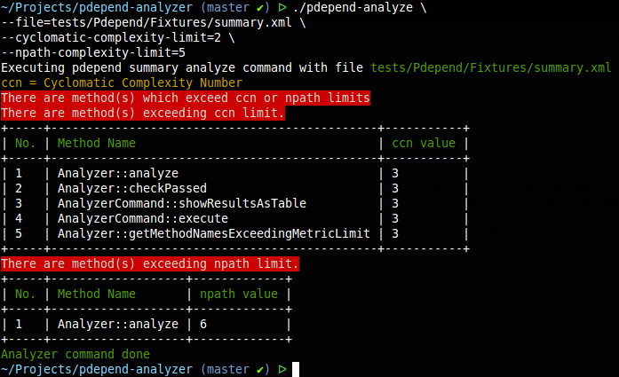

# pdepend analyze

[](https://travis-ci.org/geshan/pdepend-analyzer)

Pdepend Analyze is a command line tool that analyzes the summary xml file generated by [Pdepend](http://pdepend.org).
For now it shows the methods that have the highest
[Cylcomatic Complexity and N-Path Complexity](http://codingswag.ghost.io/cyclomatic-and-npath-complexity-explained/) in
the Pdepend summary XML file generated for any given code base. There is a [pdepend process](https://github.com/sebastianbergmann/pdepend-process)
command line tool that formats the Pdepend summary xml as HTML, its very useful. This command line tool can be used
as part of the tests or even as a pre-commit hook to lower down the software complexity.

## Prerequisites

This library needs PHP 5.4+.

It has been tested using PHP 5.4 to PHP 5.6.

## Installation

You can install the library directly with composer:

```
"geshan/pdepend-analyzer": "0.1.0"
```
## Usage

To you this command line tool, you will need to generate your code metrics using PDepend with command like below:

```shell
 ᐅ phpdepend --summary-xml=/tmp/summary.xml /path/to/your/src

```

For more information about Pdepend refer to its [docs](http://pdepend.org/documentation/getting-started.html).

After you have your `summary.xml` file with the software metrics of your code base you can run the pdepend-analyzer in
in the following ways:

### Run analyze with default params

```shell

 ᐅ ./pdepend-analyze --file=tests/Pdepend/Fixtures/summary.xml

```

### Run analyze with custom params

```shell

 ᐅ ./pdepend-analyze --file=tests/Pdepend/Fixtures/summary.xml  --cyclomatic-complexity-limit=2 --npath-complexity-limit=5

```

### Screen shot of usage with custom params




## Tests

[PHPUnit](https://phpunit.de/) is used to test the command line tool.
You will need [composer](https://getcomposer.org) to get the dependencies. To run tests locally,
execute the following commands in project root:


```shell

 ᐅ composer install --prefer-source
 ᐅ ./vendor/bin/phpunit --configuration phpunit.xml --bootstrap vendor/autoload.php

```

## Feedback

Add an issue, open a PR, drop us an email! We would love to hear from you!
